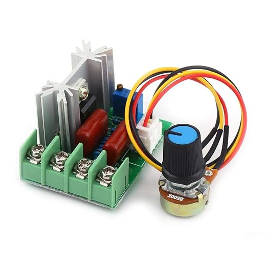

# Sunrise Alarm
forked from cboddy/sunrise-light-alarm

A [Flask](https://pypi.python.org/pypi/Flask) web-service for controlling a home brew dimmable LED light via relays with a raspberry-pi via a [Flutter](https://flutter.dev/) web-app.

## Setup

My setup uses a MOSFET from [amazon](https://www.amazon.de/gp/product/B075QFQN7S/) 
that controls the frequency of a LED 230v light bulb.

The potentiometer is replaced by relays, controlled by the pi, switching on and of resistors.

[//]: # (TODO image of my setup.)

The GPIO_mosfet_control folder controls those relays. It calculates the resistance and then switches on the
needed relays.

This setup was for learning experience. If you want to use this MOSFET then a stepper motor controlling the
potentiometer is probably easier. Or even more reasonable would be to use an USB powered
dimmable LED.

